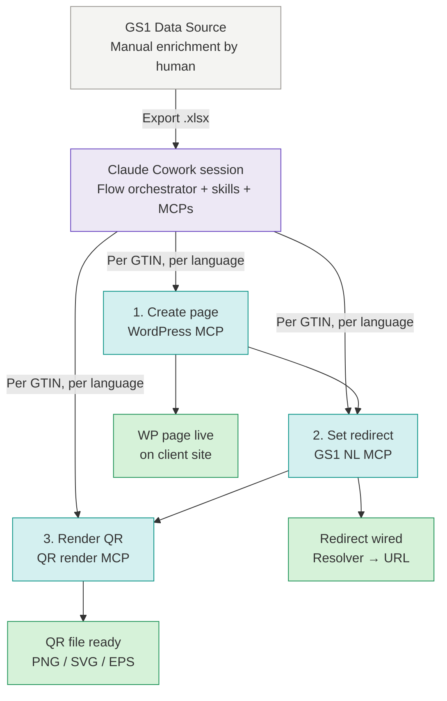

# GS1 Data Source → Digital Link QR — file locations & context

Reference note for the open-source **GS1 Digital Link Orchestrator**: a tool that turns a MyGS1 Excel export into WordPress product pages + configured GS1 resolver redirects + printable QR codes powered by GS1.

## Source of truth

**Canonical location:** the Obsidian vault at `10_Clients/MDP/Projects/Noviplast_2D/Project/`. Every Claude Code session should start by pulling the relevant notes from there.

Documents in the vault:

| Note | Purpose |
|---|---|
| [[PROJECT_HANDOVER]] | The "why" document — architecture, decisions, phases, rationale. **Read first for orientation.** Currently v0.8. |
| [[IMPLEMENTATION_SPEC]] | The "how" document. **The operational bible for coding.** Currently v0.3. |
| [[PREPARATION]] | Operator preparation checklist. Currently v0.3. |
| [[architecture]] | System diagram (inline SVG, rendered in Obsidian preview). |
| [[GS1_NL_EMAIL]] | Historical: original questions to GS1 NL. |

The local code repo (once initialised in Phase 1) will live at `~/code/gs1-digital-link-orchestrator/`, published to GitHub.

## MDP context

- **MDP** = Master Data Partners, the consultancy where the project owner works. MDP operates on behalf of clients who each have their own GS1 NL contracts.
- **Noviplast** is the pilot client for v0.1.0 — a Dutch product supplier with a WordPress catalogue site (`https://www.noviplast.nl`), multilingual NL+FR, custom post type and Polylang.
- **Other MDP clients** in the same segment (Dutch product suppliers with WordPress catalogue sites) are expected to follow after Noviplast succeeds. The tool is multi-tenant from the start.
- **Why open-source:** MDP benefits from having the tooling published; none of the code is client-specific.

## System architecture



Full inline SVG at [[architecture]].

## Project context

- **Goal:** open-source tool that lets a Dutch supplier go from a MyGS1 Excel export to a printable QR code powered by GS1 whose resolver redirects to a WordPress page the tool also provisions.
- **Data path:** Excel export from MyGS1. GS1 Data Link (paid read API) is out of scope.
- **Resolver:** GS1 NL's. QR encodes `https://id.gs1.org/01/{GTIN14}`.
- **Pilot client:** Noviplast (custom post type `noviplast`, Polylang, NL + FR).
- **Status:** ready to build.

## Running the build with an AI agent (fresh-session workflow)

Practical workflow when you clear context between phases and run the agent on auto-mode (not plan-mode) settings:

- Each phase runs in its own **fresh session** — the agent has no memory of previous phases
- Each phase prompt is **self-contained**: it tells the agent to read the docs, follow the working principles, present a plan before executing, and stop at DoD
- Between phases: **audit what the agent did in a separate fresh session** using the audit prompt template below. This catches drift before it compounds

Every phase prompt from Phase 2 onward follows the same template — only the phase-specific §refs and intent differ. See "Standard phase prompt" below.

## First prompt to Claude Code (Phase 1)

Copy the block below into the first Claude Code session. Ensure `PROJECT_HANDOVER.md` and `IMPLEMENTATION_SPEC.md` are accessible in the session context — either as attached files or by pointing Claude Code at the vault path.

````
I'm building an open-source tool called "gs1-digital-link-orchestrator" — a Python + TypeScript project that helps Dutch suppliers turn GS1 Data Source Excel exports into WordPress product pages with QR codes powered by GS1. The tool runs in Claude Cowork; deterministic Python does the work, Claude handles planning and user interaction. It's multi-tenant, open-source, self-hosted.

I have two authoritative documents that fully specify this project. Please read both in full before doing anything else:

1. PROJECT_HANDOVER.md — architecture, decisions, phases, rationale (the "why")
2. IMPLEMENTATION_SPEC.md — types, contracts, error handling, testing conventions (the "how")

IMPLEMENTATION_SPEC.md is your operational bible. If you're ever unsure how to implement something, the answer is in there. If it's genuinely not there, ask me — don't invent conventions.

# Your first task: Phase 1 — Repo skeleton

Per PROJECT_HANDOVER.md §8.2 Phase 1 and IMPLEMENTATION_SPEC.md §1 and §12:

- Initialise a Git repo with the exact structure from PROJECT_HANDOVER.md §7
- Commit:
  - MIT LICENSE
  - README.md (baseline: intent + status + links to both spec documents)
  - CHANGELOG.md starting at 0.0.1
  - .gitignore covering: clients.yml, .env, output/, input/, __pycache__, *.pyc, .venv, node_modules, dist, build
  - clients.example.yml (from PROJECT_HANDOVER.md §10.1)
  - .env.example (from PROJECT_HANDOVER.md §10.2)
  - docs/architecture.svg (copy the SVG content from the vault's architecture note)
- pyproject.toml per IMPLEMENTATION_SPEC.md §1.1
- package.json for the MCPs
- schema/clients.schema.json derived from Pydantic models in IMPLEMENTATION_SPEC.md §2.4
- GitHub Actions workflow (.github/workflows/ci.yml): on push and PR, run ruff check, ruff format --check, mypy --strict lib, pytest
- Empty directories with .gitkeep files where needed

# Working principles

- Follow the naming and style conventions in IMPLEMENTATION_SPEC.md §1 exactly. No deviation.
- Ask before improvising. If the spec doesn't cover something, ask me one clarifying question rather than guessing.
- Commit in small logical chunks with clear conventional-commit messages. Not one giant "initial commit".
- Do not start Phase 2 until we've agreed Phase 1 is done.

# Definition of Done for Phase 1 (from IMPLEMENTATION_SPEC.md §12)

- [ ] ruff check passes with zero warnings
- [ ] mypy --strict lib passes (add a lib/__init__.py if empty)
- [ ] pytest runs
- [ ] GitHub Actions workflow file committed and green on push
- [ ] README.md links to PROJECT_HANDOVER.md and IMPLEMENTATION_SPEC.md

# Please start by

1. Confirming you've read both documents in full
2. Asking any clarifying questions before writing code
3. Then execute Phase 1, committing as you go

When Phase 1's Definition of Done is fully checked, stop and tell me. I'll review, we agree it's done, then I give you the go-ahead for Phase 2.
````

## Standard phase prompt (Phase 2 through Phase 11)

Copy the template. Replace `{N}`, `{NAME}`, `{SPEC_REFS}`, and `{INTENT}` with the values from the reference table below. Paste as the first message in a fresh Claude Code session.

### Template

````
Fresh session — starting Phase {N} ({NAME}) of the GS1 Digital Link Orchestrator.
The previous phase completed in a different session; you have no memory of it.

Before doing anything else:

1. Open IMPLEMENTATION_SPEC.md §0 and follow the reader-map there.
   That loads PROJECT_HANDOVER.md and IMPLEMENTATION_SPEC.md in the right order
   and tells you which sections to consult.

2. Confirm Phase {PREV} is done: check `git log --oneline`, the last CHANGELOG.md
   entry, and the current state of the repo. If Phase {PREV}'s DoD (§12) isn't
   fully met, stop and tell me — do not try to complete it retroactively.

3. Note the working principles from IMPLEMENTATION_SPEC §1:
   - Strict spec compliance; no invented conventions
   - If the spec covers it, follow the spec; if the spec is genuinely silent, ask me
   - Small logical commits with conventional-commit prefixes (feat:, chore:, docs:, ci:, etc.)
   - Stop at DoD; do not start the next phase

For Phase {N} ({NAME}):
- Scope: PROJECT_HANDOVER.md §8.2 Phase {N} and IMPLEMENTATION_SPEC.md {SPEC_REFS}
- What to build: {INTENT}
- Definition of Done: IMPLEMENTATION_SPEC.md §12 Phase {N}

Before writing any code:

1. Present a plan: ordered steps, files you'll create or modify, tests you'll
   write, and expected commit sequence.
2. List clarifying questions if any. If the spec covers it, go with the spec;
   only ask when the spec is genuinely silent or ambiguous.
3. Wait for my "go" before executing.

Stop and report when the DoD checklist is fully green. I will audit in a
separate session before Phase {NEXT}.
````

### Reference table

Each INTENT cell ends with a **DoD headline** — the 2-3 canonical done-conditions per phase, at a glance. The full DoD checklist lives in `IMPLEMENTATION_SPEC.md §12 Phase {N}`; the agent still reads it there.

| N | Name | SPEC_REFS | INTENT |
|---|---|---|---|
| 2 | GS1 Digital Link client + MCP | §4.1, §4.3, §5, §6.3, §9.1, §12 Phase 2 | Build `lib/gs1_dl_client.py` for API v2 (upsert, upsert_bulk, get, set_enabled, validate_draft, `Authorization` header via `_auth_header()` with Bearer/raw switch, retry policy per §5.1, JSONL logging with token scrubbing). Build `mcps/gs1-nl/` in TypeScript with three MCP tools per §9.1. Fixtures per §13.2 will be provided by me; ping me when you need them. Preserve path anomalies (mixed case `digitalLink` for GET/PATCH, missing `/v2/` in ValidateDraft) exactly as documented. **DoD headline:** §6.3 idempotency contracts pass; retry logic passes with mocked 429 and 5xx; token never appears in log output; real test-env call returns expected v2 shape. |
| 3 | Excel parser + records schema | §2, §3, §4.9, §7 (E1–E7, E16–E17), §8.1, §8.5, §12 Phase 3 | Build `lib/records.py` (all types §2.1–§2.3), `lib/config.py` (types §2.4 + `load_clients()` §4.2), `scripts/parse_export.py` §8.1, `scripts/inspect_export.py` §8.5. Column-map direction: Excel-column-name as KEY, canonical field path as VALUE (§3.2). Per-language paths use dot notation (`product_name.nl`). I'll provide the pilot Noviplast export at `input/noviplast/products.xlsx`. Iterate with `--dry-run` until zero warnings. **DoD headline:** all §2 types validated with tests; edge cases E1–E7, E16–E17 have unit tests; `inspect_export.py` produces a working `column_map` from the pilot export; ProductRecord JSON round-trip preserves all fields. |
| 4 | WordPress client + MCP | §4.4, §4.5, §6.1, §6.2, §7 (E7, E8, E11), §9.2, §12 Phase 4 | Survey existing WordPress MCPs and recommend adopt vs. fork with reasons. Build `lib/wp_client.py` (app password auth, custom post types, idempotent upsert per §6.1–§6.2, media upload, plugin detection) and `lib/multilingual.py` (Polylang adapter; WPML stub raises `NotImplementedError`). MCP tools per §9.2. Staging WP URL and credentials I'll provide. **DoD headline:** §6.1 and §6.2 idempotency contracts tested against staging WP; multilingual detection returns `polylang` for Noviplast staging; edge cases E7 (image 404), E8 (mismatched meta.gtin), E11 (slug collision) covered. |
| 5 | QR + templates | §3.4, §4.6, §4.7, §6.4, §9.3, §12 Phase 5 | Build `lib/qr.py` §4.7, `lib/templates.py` §4.6 with override resolution, default templates `templates/_default/product.{nl,en,fr}.html`, Noviplast templates from PROJECT_HANDOVER §5.5. Build `mcps/qr-render/` §9.3. Manual test at end: render one QR at 20mm, print, scan with iOS + Android. **DoD headline:** §6.4 QR idempotency tested; printed 20mm QR scans on both iOS and Android; template override resolution tested; missing template raises `TemplateError` cleanly. |
| 6 | lib, scripts, state | §4.8, §5.4 (Level A + B rollback), §8.3, §10.5, §12 Phase 6 | Build `lib/state.py` §4.8 with atomic writes, `scripts/run_execute.py` §8.3 following the skeleton in §10.5. Unit tests for `lib/` with `pytest-httpx` mocking. **DoD headline:** `run_execute.py` completes end-to-end for one GTIN against staging; §6.5 idempotency contract tested; state file atomicity verified by kill-mid-write test. |
| 7 | Re-run & change detection | §8.2, §10.6, §12 Phase 7 | Build `scripts/run_plan.py` §8.2 producing `plan.json`. Extend `flow-orchestrator` skill to present plan per §10.6.1 and collect confirmations per §10.6.2, §10.6.5, §10.6.6, §10.6.7. Chat interactions must match §10.6 verbatim — concise and business-like, not conversational. **DoD headline:** change classification correct across all edge cases; chat-format diff matches §10.6 examples verbatim; full re-run flow tested in a fresh Cowork session. |
| 8 | Skills & flow orchestrator polish | §10.1–§10.5, §10.6, §12 Phase 8 | Finalise every SKILL.md file. Verify `flow-orchestrator` uses all patterns from §10.6. Test in a fresh Cowork session: user uploads export, says "run for noviplast in test env". **DoD headline:** each SKILL.md finalised per §10; full chat-driven flow works end-to-end from a single instruction; skills load on expected trigger phrases. |
| 9 | Pilot end-to-end | §12 Phase 9, PROJECT_HANDOVER §5.5 | Run end-to-end against Noviplast staging (test env). Iterate on edge cases; capture quirks in `docs/clients/noviplast.md`. First 10 real products through to production. **DoD headline:** ≥10 real products live on Noviplast production; every printed QR sample scans and resolves correctly; no manual corrections needed during the run. |
| 10 | Docs | §4.1 (troubleshooting per error type), §12 Phase 10, PROJECT_HANDOVER §4.3, §5.1–§5.4, §5.5 | Write `docs/setup.md`, `docs/costs.md`, `docs/gs1-nl-onboarding.md` (from PROJECT_HANDOVER §5.1–§5.3), `docs/wordpress-onboarding.md` (from PROJECT_HANDOVER §5.4), `docs/data-source-export-schema.md`, `docs/template-variables.md`, `docs/troubleshooting.md`. Polish README with quickstart, architecture embed, and links. **DoD headline:** unfamiliar user can clone, follow `setup.md`, and onboard a second client without asking questions; every skill and script has a docstring; `troubleshooting.md` covers each error type from §4.1. |
| 11 | Production cut + 0.1.0 release | §12 Phase 11 | Bump version to 0.1.0 in `pyproject.toml` and `package.json`. Populate `CHANGELOG.md`. Git tag `v0.1.0` and push. Submit MCP to registry. Draft short announcement (LinkedIn/dev.to). Add GitHub issue templates. **DoD headline:** version bumped consistently across `pyproject.toml`, `package.json`, `CHANGELOG.md`; git tag `v0.1.0` pushed; MCP registry entry submitted; announcement drafted (publication optional). |

When substituting `{PREV}` and `{NEXT}` in the template: for Phase 2, PREV = 1 and NEXT = 3; for Phase 11, NEXT = "(none, project complete)".

## Post-phase audit prompt

Copy this into a **fresh** Claude Code session after any phase completes, to verify the DoD is truly met. The audit runs in a different session than the build so the auditor has clean eyes — this catches issues the builder overlooked.

Replace `{N}` with the phase number that was just completed.

````
Fresh session — auditing the just-completed Phase {N} of the GS1 Digital Link
Orchestrator. Do NOT modify anything; only report findings.

Read first:
- IMPLEMENTATION_SPEC.md §0 (reader-map), §1 (conventions), §12 Phase {N} (Definition of Done)
- PROJECT_HANDOVER.md §7 (repo structure) and §8.2 Phase {N}
- Any other sections §12 Phase {N} references

Then audit the current repo state:

1. Every item in §12 Phase {N}'s DoD checklist — report ✅ met, ⚠️ partial
   (explain why), ❌ missed (explain what's absent).

2. Repo structure vs §7: all listed files and directories present or
   .gitkeep'd. .gitignore covers clients.yml, .env, output/, input/,
   __pycache__, *.pyc, .venv, node_modules, dist, build.

3. Code style vs §1: naming (snake_case for functions, PascalCase for
   classes, SCREAMING_SNAKE for constants), type hints on every public
   signature, Google-style docstrings, absolute imports, no wildcard
   imports, no bare Exception raises.

4. Git log: commits are small logical chunks with conventional-commit
   prefixes (feat:, chore:, docs:, ci:, etc.). Not one giant "initial commit"
   or "phase N".

5. Phase-specific spot checks:
   - Phase 1: clients.example.yml matches §10.1 exactly, including that
     `column_map` uses Excel-column-name as KEY and dotted field path as VALUE
     (this direction was recently corrected — reverse direction is wrong).
     .env.example matches §10.2 (NOVIPLAST_GS1_TOKEN_TEST/PROD, not _KEY_).
     GitHub Actions workflow is green on the last push.
   - Phase 2: preserve mixed-case paths for GET/PATCH endpoints
     (`digitalLink` capital L), lowercase for POST create/update.
     ValidateDraft path has no `/v2/` segment. Verify GS1APIError.error_results
     is populated on structured 400 bodies.
   - Phase 3: column_map direction is Excel→field (§3.2), not field→Excel.
     `product_name.nl` uses dot notation, not underscore.
   - Phase 4: idempotency via meta.gtin lookup, not only slug.
   - Phase 5: uppercase URI trick applied for QR encoding.
   - Phase 6: state.json writes are atomic (temp-then-rename).
   - Phase 7: chat format matches §10.6 verbatim, not paraphrased.
   - Phase 9: no manual corrections during the run.

Report format:
- One-line verdict at top: "DoD passes" / "DoD passes with concerns" /
  "DoD fails on X items"
- ✅ Section: items that clearly pass
- ⚠️ Section: items that partially work — one line per item with the concern
- ❌ Section: items missing or broken — one line per item with what's absent
- Recommendation: "green-light Phase {N+1}" or list specific fixes required first

Do not make any changes to the repo. Wait for my instruction after your report.
````

## Open items

Tracked in [[Investigation (Noviplast_2D)]]:

- **Real MyGS1 Excel export from Noviplast** → `input/noviplast/products.xlsx`. Blocks Phase 3.
- **Five sample responses from the Digital Link API** (test env) → `tests/fixtures/gs1_api/`. Blocks Phase 2 completion.
- **Staging WordPress access for Noviplast** — user `automation-bot`, application password `gs1-orchestrator`, custom post type `noviplast` with `show_in_rest: true`, Polylang for NL + FR. Blocks Phase 4 completion.

## Notes

- The three spec documents ([[PREPARATION]], [[PROJECT_HANDOVER]], [[IMPLEMENTATION_SPEC]]) are the source of truth for the project. Bump their version numbers when materially updated. Frozen decisions ([[PROJECT_HANDOVER]] §3) shouldn't drift silently.
- Credentials never live in the vault or the code repo. `.env` (gitignored, machine-local) holds the actual secrets; `.env.example` in the repo documents the shape.
- As MDP onboards more clients with the same case, add their discovery notes to [[PROJECT_HANDOVER]] §5.5 or fork the section into a `docs/clients/` folder in the code repo.