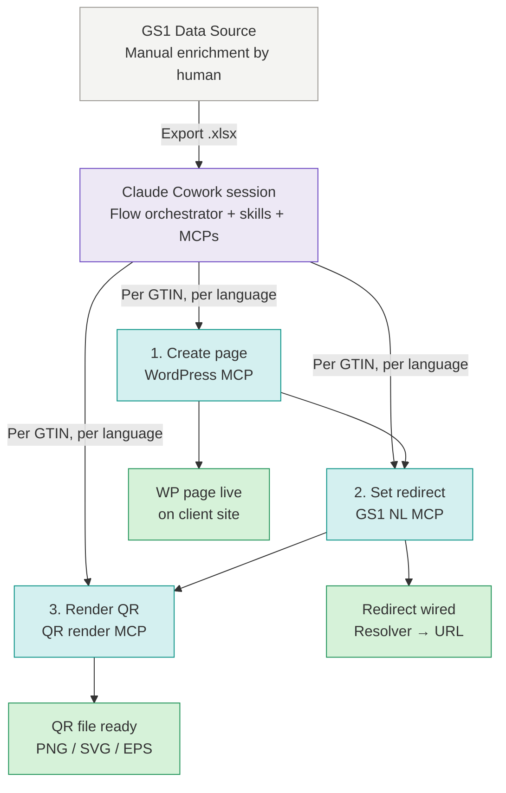

# GS1 Data Source → Digital Link QR — file locations & context

Reference note for the open-source **GS1 Digital Link Orchestrator**: a tool that turns a MyGS1 Excel export into WordPress product pages + configured GS1 resolver redirects + printable QR codes powered by GS1.

## Where the files live

All working files are on the local machine, in a Google Drive–synced folder (not stored in this vault). Because the folder path contains an `@` in `nextgendatalead@gmail.com`, plain text renderings can be misread as an email address — the encoded `file://` URL below opens Finder cleanly:

```
/Users/idekker/Library/CloudStorage/GoogleDrive-nextgendatalead@gmail.com/My Drive/Projects/MDP/Noviplast_Wordpress_GS1DataLink
```

[Open in Finder](file:///Users/idekker/Library/CloudStorage/GoogleDrive-nextgendatalead%40gmail.com/My%20Drive/Projects/MDP/Noviplast_Wordpress_GS1DataLink)

> Path follows the MDP project convention. Access is local to this machine / Google Drive account.

Files placed there:

| File | What it is |
|---|---|
| `PROJECT_HANDOVER.md` | The "why" document — architecture, decisions, phases, rationale. **Read first for orientation.** Currently v0.6. |
| `IMPLEMENTATION_SPEC.md` | The "how" document — types, module contracts, error handling, edge cases, chat patterns, rollback semantics, Definition of Done per phase. **The operational bible for coding.** Currently v0.2. |
| `architecture.svg` | System diagram (also embedded below). Reuse as `docs/architecture.svg` in the repo. |
| `GS1_NL_EMAIL.txt` | Historical: original questions to GS1 NL, resolved by phone May–June 2026. |

The local code repo (once initialised in Phase 1) will live at `~/code/gs1-digital-link-orchestrator/`, published to GitHub.

## MDP context

- **MDP** = Master Data Partners, the consultancy where the project owner works. MDP is not a GS1 NL member itself for the purpose of this project; it operates on behalf of MDP's clients who each have their own GS1 NL contracts.
- **Noviplast** is the pilot client for v0.1.0 — a Dutch product supplier with a WordPress catalogue site (`https://www.noviplast.nl`), multilingual NL+FR, custom post type and Polylang. Chosen because it exercises the multi-language and custom-post-type paths that will recur across other clients.
- **Other MDP clients** in the same segment (Dutch product suppliers with WordPress catalogue sites) are expected to follow after Noviplast succeeds. The tool is designed multi-tenant from the start so onboarding client 2, 3, N is a config-and-template change, not a code change. Each client uses their own GS1 NL credentials, their own WordPress site, their own template.
- **Why open-source:** MDP benefits from having the tooling published (positioning, contribution, no per-client licence overhead) and none of the code is client-specific — client data stays in each client's own environment.

## System architecture



Same diagram as an SVG file: `architecture.svg` in the Google Drive folder. Save a copy at `docs/architecture.svg` in the code repo once Phase 1 is done.

## Project context

- **Goal:** open-source tool that lets a Dutch supplier (with an existing GS1 Data Source contract) go from a MyGS1 Excel export to a printable QR code powered by GS1 whose resolver redirects to a WordPress page the tool also provisions. Multi-tenant via `clients.yml`; every user brings their own credentials.
- **Architecture:** runs in Claude Cowork. Deterministic Python scripts do the per-row loop (WP upsert → verify 200 → GS1 redirect → QR render). Claude handles planning, in-chat diff prompting on changes, and exception interpretation. Three MCPs (GS1 NL, WordPress, QR render) expose interactive single-call tools; shared `lib/` layer holds the HTTP clients used by both MCPs and scripts.
- **Data path:** Excel export from MyGS1, always. GS1 Data Link (the paid read API, €2.469+/yr) is out of scope — Excel is included in the existing Data Source contract.
- **Resolver:** GS1 NL's, always. QR encodes `https://id.gs1.org/01/{GTIN14}`; the resolver redirects to the client's own WordPress page. Digital Link write-API is **free**; keys via MyGS1.
- **Pilot client:** Noviplast (custom post type `noviplast`, Polylang, NL + FR).
- **Status:** ready to build. All blocking questions to GS1 NL answered; keys for test + production obtained.

## First prompt to Claude Code (Phase 1)

Copy the block below (everything between the fences) into the first Claude Code session. Ensure `PROJECT_HANDOVER.md` and `IMPLEMENTATION_SPEC.md` are accessible in the session context (same working directory, or attached).

```
I'm building an open-source tool called "gs1-digital-link-orchestrator" — a Python + TypeScript project that helps Dutch suppliers turn GS1 Data Source Excel exports into WordPress product pages with QR codes powered by GS1. The tool runs in Claude Cowork; deterministic Python does the work, Claude handles planning and user interaction. It's multi-tenant, open-source, self-hosted.

I have two authoritative documents that fully specify this project. Please read both in full before doing anything else:

1. PROJECT_HANDOVER.md — architecture, decisions, phases, rationale (the "why")
2. IMPLEMENTATION_SPEC.md — types, contracts, error handling, testing conventions (the "how")

IMPLEMENTATION_SPEC.md is your operational bible. If you're ever unsure how to implement something, the answer is in there. If it's genuinely not there, ask me — don't invent conventions.

# Your first task: Phase 1 — Repo skeleton

Per PROJECT_HANDOVER.md §8.2 Phase 1 and IMPLEMENTATION_SPEC.md §1 and §12:

- Initialise a Git repo with the exact structure from PROJECT_HANDOVER.md §7
- Commit:
  - MIT LICENSE
  - README.md (baseline: intent + status + links to both spec documents)
  - CHANGELOG.md starting at 0.0.1
  - .gitignore covering: clients.yml, .env, output/, input/, __pycache__, *.pyc, .venv, node_modules, dist, build
  - clients.example.yml (from PROJECT_HANDOVER.md §10.1)
  - .env.example (from PROJECT_HANDOVER.md §10.2)
  - docs/architecture.svg (copy from the project's Google Drive folder)
- pyproject.toml per IMPLEMENTATION_SPEC.md §1.1 (Python 3.11+, httpx, pydantic, openpyxl, pyyaml, qrcode[pil], pystache, jsonschema; dev deps pytest, pytest-httpx, mypy, ruff; ruff and mypy configured)
- package.json for the MCPs (Node 20+, TypeScript, @modelcontextprotocol/sdk as dependency)
- schema/clients.schema.json derived from the Pydantic models in IMPLEMENTATION_SPEC.md §2.4
- GitHub Actions workflow (.github/workflows/ci.yml): on push and PR, run `ruff check`, `ruff format --check`, `mypy --strict lib`, `pytest`
- Empty directories with .gitkeep files where needed: lib/, scripts/, mcps/, skills/, templates/_default/, templates/, tests/lib/, tests/scripts/, tests/fixtures/, docs/, input/

# Working principles

- Follow the naming and style conventions in IMPLEMENTATION_SPEC.md §1 exactly. No deviation.
- Ask before improvising. If the spec doesn't cover something, ask me one clarifying question rather than guessing.
- Commit in small logical chunks with clear conventional-commit messages (feat:, chore:, docs:, ci:, etc.). Not one giant "initial commit".
- Do not start Phase 2 until we've agreed Phase 1 is done.

# Definition of Done for Phase 1 (from IMPLEMENTATION_SPEC.md §12)

- [ ] `ruff check` passes with zero warnings
- [ ] `mypy --strict lib` passes (even though lib/ is empty — add a lib/__init__.py)
- [ ] `pytest` runs (may pass with zero tests)
- [ ] GitHub Actions workflow file committed and green on push
- [ ] README.md links to PROJECT_HANDOVER.md and IMPLEMENTATION_SPEC.md

# Please start by

1. Confirming you've read both documents in full
2. Asking any clarifying questions you have before writing code (there may be none — but ask if so)
3. Then execute Phase 1, committing as you go

When Phase 1's Definition of Done is fully checked, stop and tell me. I'll review, we agree it's done, then I give you the go-ahead for Phase 2.
```

## Prompts for phases 2 – 11

Same pattern each time: reference the phase in `PROJECT_HANDOVER.md` §8.2, the relevant sections in `IMPLEMENTATION_SPEC.md`, and the Definition of Done in §12. Reaffirm working principles briefly. Stop at DoD.

### Phase 2 — GS1 Digital Link client + MCP

```
Phase 2 is up. Per PROJECT_HANDOVER.md §8.2 Phase 2 and IMPLEMENTATION_SPEC.md §4.1, §4.3, §5 (error handling), §6.3 (idempotency), and §12 Phase 2, please implement:

- lib/gs1_dl_client.py: auth via Ocp-Apim-Subscription-Key header (§4.3), upsert / upsert_bulk / get, retries per §5.1, JSONL logging
- mcps/gs1-nl/ in TypeScript with MCP SDK: three tools (gs1_digital_link_upsert, gs1_digital_link_upsert_bulk, gs1_digital_link_get) per §9.1
- Integration test against gs1nl-api-acc.gs1.nl with one real GTIN
- Fixtures under tests/fixtures/gs1_api/ per §13.2 — I'll capture these with curl and share them with you; ping me when you need them

Follow the same working principles as Phase 1. Ask before deviating from the spec.

Definition of Done for Phase 2 (from IMPLEMENTATION_SPEC.md §12):
- [ ] All idempotency contracts in §6.3 tested and green
- [ ] Retry logic tested via pytest-httpx with mocked 429 and 5xx
- [ ] PII scrubbing verified: unit test asserts secrets not in log output
- [ ] Real test-env call returns expected shape
- [ ] MCP tool callable, returns success for one real GTIN

Stop and tell me when DoD is checked.
```

### Phase 3 — Excel parser + records schema

```
Phase 3 is up. Per PROJECT_HANDOVER.md §8.2 Phase 3 and IMPLEMENTATION_SPEC.md §2 (types), §3 (column mapping), §4.9 (records), §7 (edge cases E1–E7, E16–E17), §8.1 (parse_export.py), and §12 Phase 3, please implement:

- lib/records.py: all types per §2.1–§2.3
- lib/config.py: types per §2.4 and load_clients() per §4.2
- scripts/parse_export.py per §8.1
- scripts/inspect_export.py per §8.5 (utility for onboarding)

I have the pilot Noviplast Excel export at input/noviplast/products.xlsx — use this to define the actual column_map in clients.yml. Iterate with --dry-run until zero warnings on required fields.

Definition of Done for Phase 3 (from IMPLEMENTATION_SPEC.md §12):
- [ ] All types in §2 defined and covered by validation tests
- [ ] Edge cases E1–E7, E16–E17 have unit tests
- [ ] inspect_export.py suggests a working column_map from the pilot export
- [ ] Round-trip: ProductRecord → JSON → ProductRecord preserves all fields

Stop and tell me when DoD is checked.
```

### Phase 4 — WordPress client + MCP

```
Phase 4 is up. Per PROJECT_HANDOVER.md §8.2 Phase 4, §5.4 (WP onboarding), §5.5 (Noviplast findings), and IMPLEMENTATION_SPEC.md §4.4 (wp_client), §4.5 (multilingual), §6.1, §6.2 (idempotency), §7 (E7, E8, E11), §9.2, and §12 Phase 4, please implement:

- Survey existing WordPress MCPs; recommend adopt vs. fork with reasons
- lib/wp_client.py: app password auth, custom post types, idempotent upsert, media upload, plugin detection
- lib/multilingual.py: Polylang adapter (WPML stub raises NotImplementedError)
- MCP tools per §9.2

Staging WP is at [URL to fill in]. Application password stored in NOVIPLAST_WP_APP_PASS env var.

Definition of Done for Phase 4 (from IMPLEMENTATION_SPEC.md §12):
- [ ] Idempotency contracts §6.1 and §6.2 tested against staging WP
- [ ] Multilingual detection returns "polylang" for staging site
- [ ] Edge cases E7, E8, E11 covered

Stop and tell me when DoD is checked.
```

### Phase 5 — QR rendering + templates

```
Phase 5 is up. Per PROJECT_HANDOVER.md §8.2 Phase 5 and IMPLEMENTATION_SPEC.md §3.4 (templates), §4.6 (templates.py), §4.7 (qr.py), §6.4 (QR idempotency), §9.3 (qr-render-mcp), and §12 Phase 5:

- lib/qr.py per §4.7
- lib/templates.py per §4.6 with override resolution
- templates/_default/product.{nl,en,fr}.html
- templates/noviplast/product.{nl,fr}.html — build from the Noviplast findings in PROJECT_HANDOVER §5.5
- mcps/qr-render/ per §9.3

Manual test at end: render one QR for a pilot GTIN, print at 20mm, scan with iOS and Android cameras.

Definition of Done for Phase 5:
- [ ] Idempotency contract §6.4 tested
- [ ] Rendered QR at 20mm scans successfully with both iOS and Android
- [ ] Template override resolution tested
- [ ] Missing template raises TemplateError cleanly

Stop and tell me when DoD is checked.
```

### Phase 6 — lib, scripts, state

```
Phase 6 is up. Per PROJECT_HANDOVER.md §8.2 Phase 6 and IMPLEMENTATION_SPEC.md §4.8 (state.py), §5.4 (rollback semantics — implement Level A + B), §8.3 (run_execute.py), §10.5 (run_execute reference), §12 Phase 6:

- lib/state.py per §4.8, with atomic writes
- scripts/run_execute.py per §8.3 and the skeleton in §10.5
- Unit tests for lib/ with mocked HTTP via pytest-httpx

Definition of Done for Phase 6:
- [ ] run_execute.py completes for one GTIN end-to-end against staging
- [ ] Idempotency contract §6.5 tested
- [ ] State file atomicity: kill mid-write, verify no corruption

Stop and tell me when DoD is checked.
```

### Phase 7 — Re-run and change detection

```
Phase 7 is up. Per PROJECT_HANDOVER.md §8.2 Phase 7 and IMPLEMENTATION_SPEC.md §8.2 (run_plan.py), §10.6 (chat interaction patterns for flow-orchestrator), §12 Phase 7:

- scripts/run_plan.py per §8.2 producing plan.json
- Extend flow-orchestrator skill to present the plan per §10.6.1 and collect confirmations per §10.6.2, §10.6.5, §10.6.6, §10.6.7
- The chat interactions must exactly match §10.6 — concise and business-like, not conversational

Definition of Done for Phase 7:
- [ ] Change classification correctness tested for all edge cases
- [ ] Chat-format diff readable and matches §10.6 examples
- [ ] Full re-run flow tested in a fresh Cowork session

Stop and tell me when DoD is checked.
```

### Phase 8 — Skills and flow orchestrator polish

```
Phase 8 is up. Per PROJECT_HANDOVER.md §8.2 Phase 8 and IMPLEMENTATION_SPEC.md §10 (skills), §10.6 (chat patterns), §12 Phase 8:

- Finalise all SKILL.md files per §10.1–§10.5
- Verify the flow-orchestrator skill uses all patterns from §10.6 (plan summary, diffs, progress, post-execute summary, missing-field handling, language selection, environment confirmation)
- Test in a fresh Cowork session: user uploads export, says "run for noviplast in test env"

Definition of Done for Phase 8:
- [ ] Each SKILL.md finalised
- [ ] Full flow via chat instruction works end-to-end
- [ ] Skills load when expected trigger phrases used

Stop and tell me when DoD is checked.
```

### Phase 9 — Pilot client end-to-end

```
Phase 9 is up. Per PROJECT_HANDOVER.md §8.2 Phase 9 and IMPLEMENTATION_SPEC.md §12 Phase 9:

- Run end-to-end against Noviplast staging (test env)
- Iterate on edge cases; capture quirks in docs/clients/noviplast.md
- Run first 10 real products through to production

Definition of Done for Phase 9:
- [ ] ≥10 real products live on Noviplast production
- [ ] Every printed QR sample scans and resolves correctly
- [ ] No manual corrections needed during the run

Stop and tell me when DoD is checked.
```

### Phase 10 — Docs

```
Phase 10 is up. Per PROJECT_HANDOVER.md §8.2 Phase 10 and IMPLEMENTATION_SPEC.md §12 Phase 10:

- docs/setup.md: install, config, env vars, first run, with cost note at top
- docs/costs.md: what users pay GS1 NL (Excel mode: nothing extra)
- docs/gs1-nl-onboarding.md: content from PROJECT_HANDOVER §5.1–§5.3
- docs/wordpress-onboarding.md: content from PROJECT_HANDOVER §5.4
- docs/data-source-export-schema.md: column reference from PROJECT_HANDOVER §4.3
- docs/template-variables.md: content from IMPLEMENTATION_SPEC §3.4
- docs/troubleshooting.md: covers each error type in IMPLEMENTATION_SPEC §4.1
- Polish README.md with quickstart, architecture.svg embed, and links

Definition of Done for Phase 10:
- [ ] A fresh user can clone, follow setup.md, and onboard a second client without asking questions
- [ ] Every skill and script has a docstring
- [ ] Troubleshooting doc covers each error type

Stop and tell me when DoD is checked.
```

### Phase 11 — Production cut and 0.1.0 release

```
Phase 11 is up. Per PROJECT_HANDOVER.md §8.2 Phase 11 and IMPLEMENTATION_SPEC.md §12 Phase 11:

- Bump version in pyproject.toml and package.json to 0.1.0
- Populate CHANGELOG.md
- Git tag v0.1.0 and push
- Submit MCP to the MCP registry
- Draft short announcement (LinkedIn / dev.to)
- Add issue templates for community contributions

Definition of Done for Phase 11:
- [ ] Version bumped everywhere consistently
- [ ] CHANGELOG.md populated with 0.1.0 highlights
- [ ] Git tag v0.1.0 pushed
- [ ] MCP registry entry submitted
- [ ] Announcement drafted (not necessarily published)

Stop and tell me when DoD is checked. After this, project is live.
```

## Open items (data still to gather; see `IMPLEMENTATION_SPEC.md` §13)

- **Real MyGS1 Excel export from Noviplast** → `input/noviplast/products.xlsx`. Needed to lock the `column_map` in `clients.yml` against actual column names. Blocks Phase 3.
- **Five sample responses from the Digital Link API** (test env) → `tests/fixtures/gs1_api/`. Run the five curl commands from §13.2 once a test GTIN has Digital Link activated in MyGS1. Blocks Phase 2 completion.
- **Staging WordPress access for Noviplast** — user `automation-bot` with application password named `gs1-orchestrator`, custom post type `noviplast` registered with `show_in_rest: true`, Polylang configured for NL + FR. Blocks Phase 4 completion.

## Notes

- The two spec documents are the source of truth for the project; this note only records where they sit and how to start each Claude Code session.
- Keep the spec documents in sync with reality — bump their version numbers when materially updated. Frozen decisions (§3 of `PROJECT_HANDOVER.md`) shouldn't drift silently.
- Credentials never live in the vault or the repo. `.env` (gitignored, machine-local) holds the actual secrets; `.env.example` in the repo documents the shape.
- The frontmatter `location` value uses URL-encoding (`%40` for `@`, `%20` for spaces) so Obsidian doesn't mistake it for an email address. Clicking it opens the folder in Finder, not Mail.
- Related client folders that might spawn similar projects live at `10_Clients/MDP/Projects/`. As MDP onboards more clients with the same case, add their discovery notes to `PROJECT_HANDOVER.md` §5.5 or fork the section into a `docs/clients/` folder in the repo.
