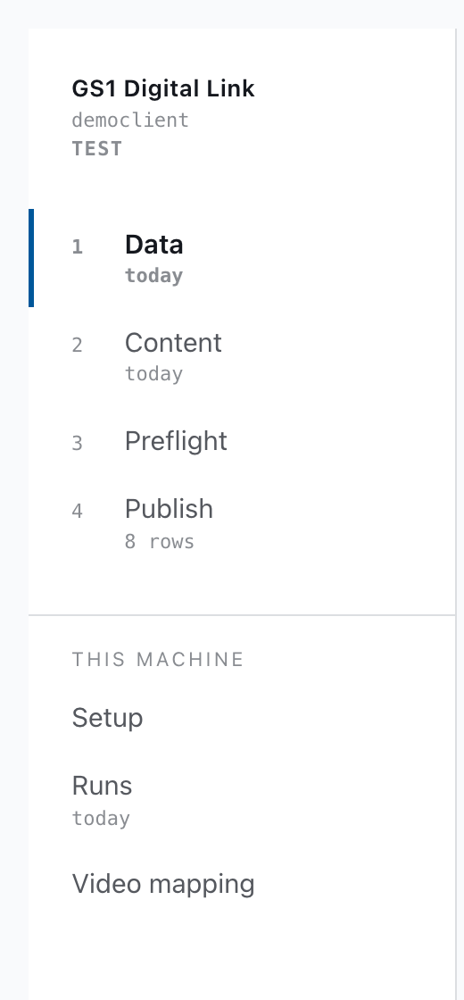
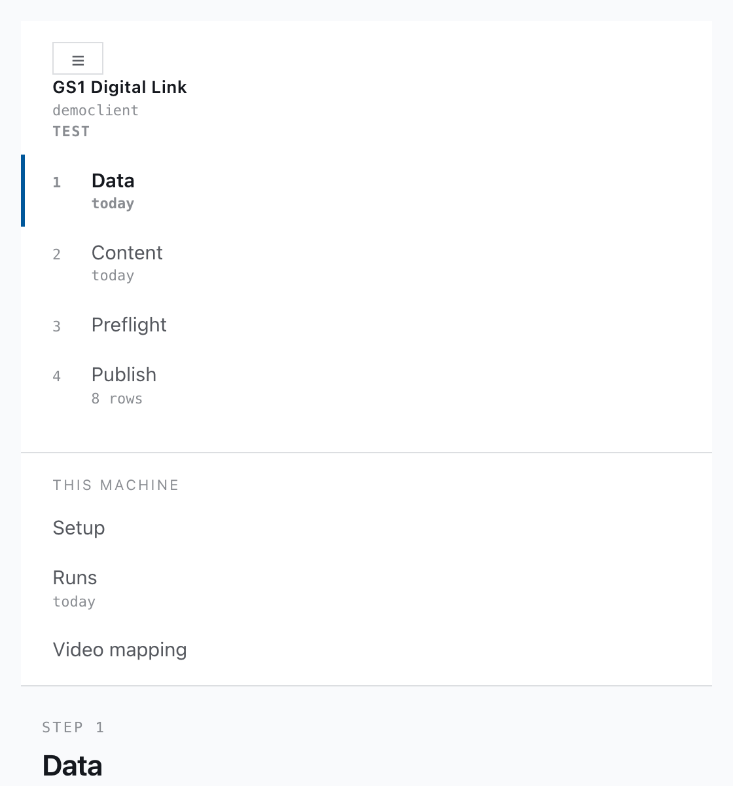
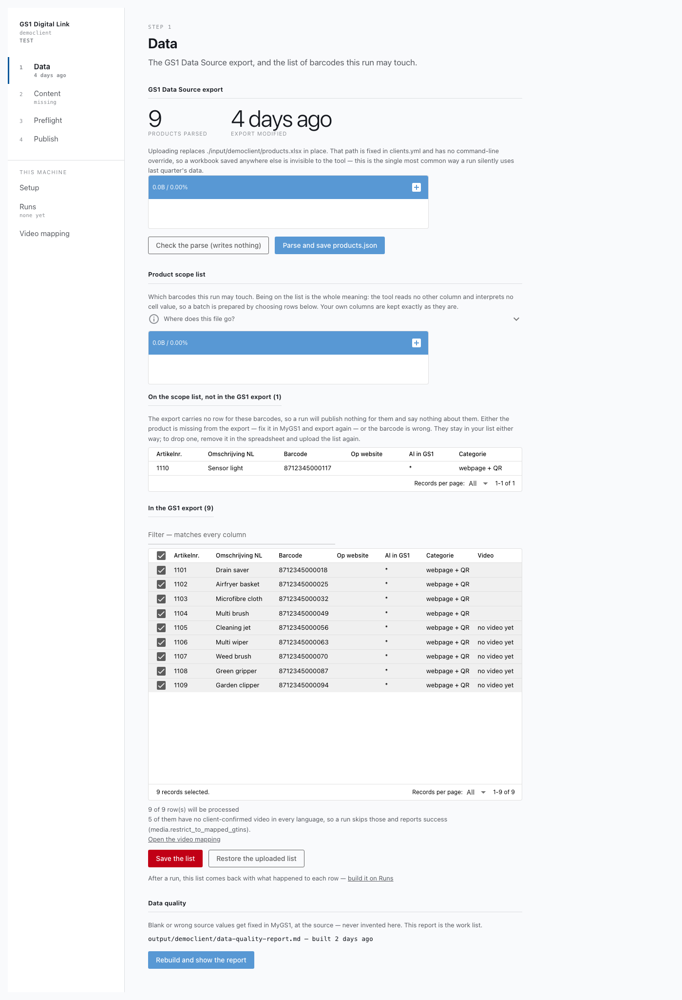
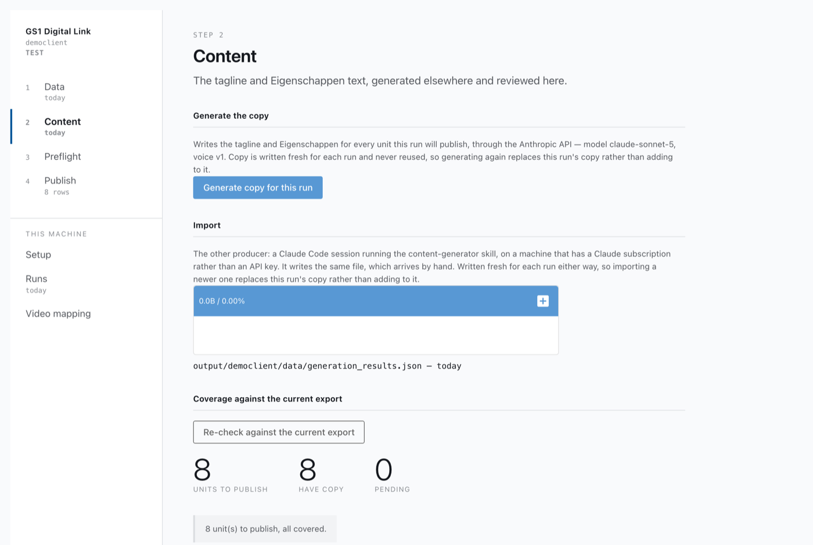
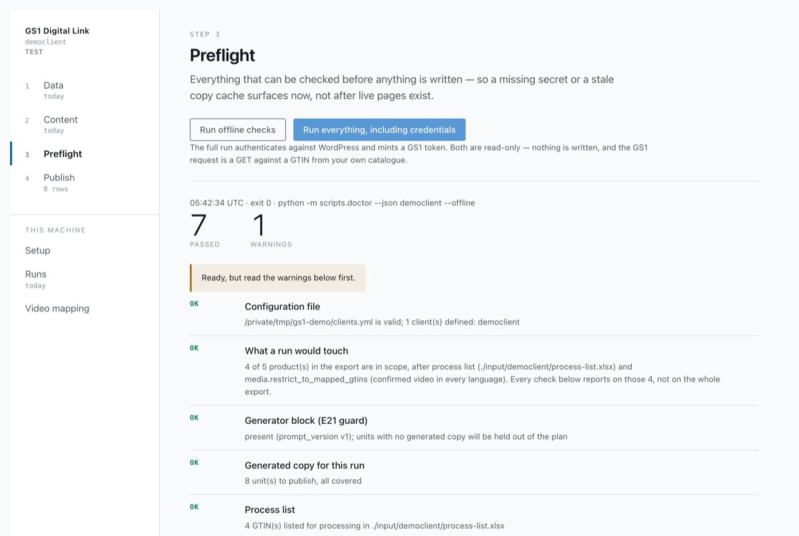
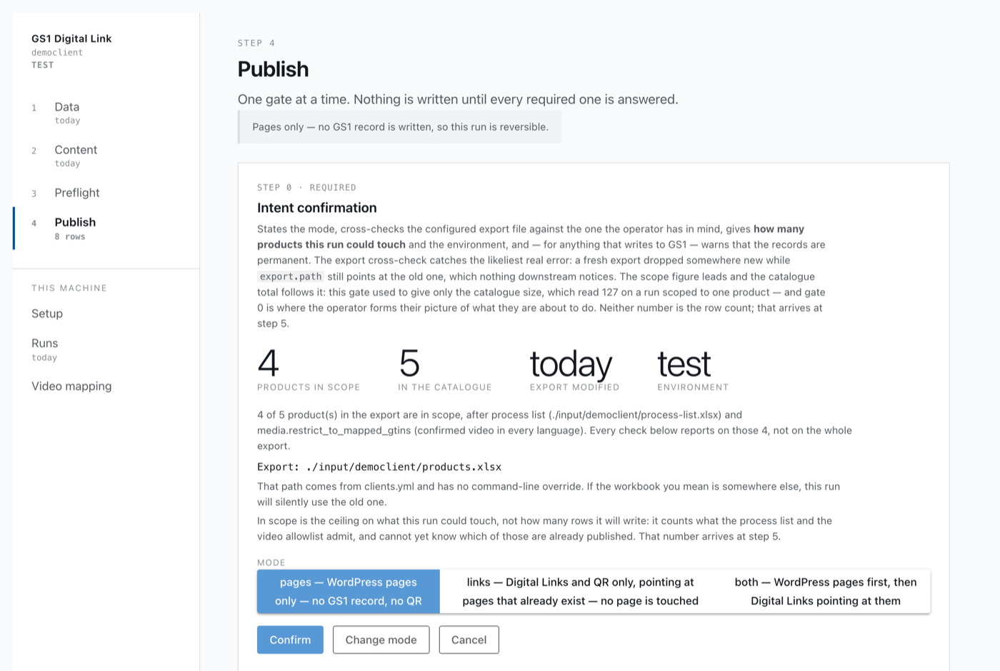
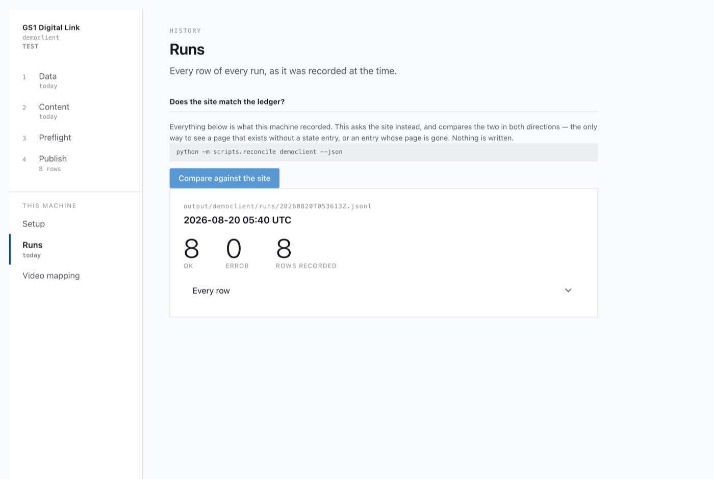
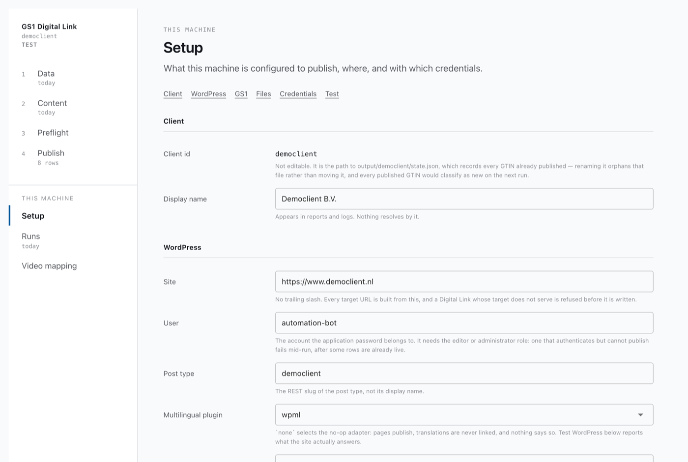

# Publishing a batch: the operator's guide

This is the walkthrough for the person who runs the tool. It assumes no Python, no terminal and no
knowledge of how any of it works — only that you have the folder, you have double-clicked
`start.command` (or `start.bat`), and a window is open in front of you.

If that has not happened yet, [`operator-install.md`](operator-install.md) is the page for it.
Come back here once the window opens.

> **The one thing to know before you start.** Some of what this tool writes cannot be undone. A
> WordPress page can be edited or deleted afterwards; a **GS1 Digital Link record cannot**. Once a
> barcode has a record, it exists permanently — it can be emptied and switched off, never removed.
> The tool asks you to confirm before it writes one, every time, and this guide points out each
> place it does.

---

## What you are doing

You have a spreadsheet of products from GS1. For each product you want:

1. a page on the website, in each language, and
2. a barcode that leads a phone to that page.

The tool does both. You work through four screens in order, and each one has a single job:

| | Screen | Its job |
|---|---|---|
| 1 | **Data** | Load the product spreadsheet, and choose which products this batch covers |
| 2 | **Content** | Get the marketing text for those products, and read it |
| 3 | **Preflight** | Check everything that can be checked before anything is written |
| 4 | **Publish** | Do it, one confirmation at a time |

A **batch** is one pass through those four. You will do it again next time there are new products.

---

## The window

The strip down the left is how you move around. It has two halves, and the difference matters:

- **The numbered four are the batch.** Work down them in order. Under each one the tool shows you
  a small fact about where you stand — how old the spreadsheet is, how many rows are planned. They
  are facts, not ticks: "today" tells you the file is recent, not that it is the right file.
- **Below the line is everything else.** *Setup* is the site settings, set up once and rarely
  touched. *Runs* is the record of what happened. *Video mapping* is one file's editor. None of
  them is a step; you go there when you need them.

At the top it always says which client you are working on and, underneath, the environment:
**TEST** in grey, or **PRODUCTION** in red. That tag is the single most important thing in the
window — PRODUCTION means the GS1 records this run writes are real and permanent.

If the window is narrow, the strip folds up behind a **☰** button:

Every screen also prints the exact command it is about to run, in a grey monospaced line. You never
need to type it. It is there so that if something goes wrong, you can copy that line into an email
and whoever helps you knows exactly what happened.

---

## Step 1 — Data

**What this screen is for:** the two spreadsheets a batch is made of. They are different documents
from different places, so they have a section each.

**What you do, in order:**

1. **GS1 Data Source export** — the product *data*. If the maintainer sent you a new spreadsheet,
   drop it on the upload area. It replaces the one already there and keeps the old one beside it.
   Then press **Parse and save products.json** — that is the tool reading the spreadsheet.
   - *Check the parse (writes nothing)* does the same read without saving, if you just want to see
     whether the file is readable.
   - If a band appears saying the export is newer than the last parse, press Parse. The count on
     the left is from the older file until you do.
2. **Product scope list** — which barcodes this batch may touch. Drop the new one on its upload
   area; it is checked before it replaces anything, so a file that will not open is refused and
   the list you were using stays put.

   > ⚠️ **A tick means keep.** Every row arrives ticked, and a run processes the ticked ones.
   > Untick a row to leave that product out, then press **Save the list**. If you used an earlier
   > version of this app, the box under the table used to say *Remove selected rows* and meant the
   > opposite — that button is gone.

   Two tables, and the top one is the one to read first: **On the scope list, not in the GS1
   export** lists barcodes you asked for that the export has no row for. Nothing else in the tool
   will mention them again. Either the product is missing from the export — which is fixed in
   MyGS1 and re-exported — or the barcode is wrong. It has no tick boxes on purpose: there is
   nothing to choose, because nothing can process them. They stay in your list; to drop one,
   remove it in the spreadsheet and upload the list again.

   The line under the tables always says how many rows will be processed out of how many there
   are. Use the filter box to find a product; filtering changes only what you can see, never what
   is ticked, and the line says how many are showing while a filter is on.

   Got it wrong? **Restore the uploaded list** puts back the file you uploaded, in one click.
3. **Data quality** at the bottom builds a report of what is missing or wrong in the spreadsheet
   itself. Blank values get fixed in MyGS1, not here. The date beside it says when it was last
   built, so you can tell this week's worklist from last week's.

**Done looks like:** a product count and a recent date under *GS1 Data Source export*, nothing
unexpected in the top table, and a line under the bottom one naming exactly the number of products
you mean.

**Stop if:** the scope list shows a red band saying the file cannot be read. Upload it again, or
ask the maintainer for a fresh copy — do not go looking for the file in a folder to replace by
hand.

---

## Step 2 — Content

**What this screen is for:** the tagline and the Eigenschappen text that go on each page. They are
written by Claude, not taken from the spreadsheet.

**Where the text comes from — one of two places, depending on how your machine is set up:**

- **Generate the copy** — if this section shows a button, your machine can write the copy itself.
  Press **Generate copy for this run** and wait; the output appears in a black panel as it goes.
- **Import** — otherwise the maintainer writes it and sends you a file called
  `generation_results.json`. Drop it on the upload area here.

Either way the copy is written **fresh for this batch**. Generating or importing again replaces it
rather than adding to it.

**Then read it.** *Coverage against the current export* gives three numbers — how many units this
batch will publish, how many have copy, how many are still pending. You want the middle one to
equal the first and the last to be zero. Below that, *Review the copy* shows the actual text, per
product, per language. **Read it.** This is the last comfortable moment to catch a sentence that is
wrong; after Publish it is on the live site.

**Done looks like:** "N unit(s) to publish, all covered."

**Stop if:** the pending number is not zero. Those products have no text and will be dropped from
the batch silently.

---

## Step 3 — Preflight

**What this screen is for:** everything that can be checked before anything is written. It runs by
itself when you arrive.

Each line is one check, marked **ok**, **warn** or **FAIL**, with a sentence saying what it found
and — when it failed — what to do about it. The verdict at the top is the one to read first.

- **ok** — nothing to do.
- **warn** — read it. The run can proceed; something is less than ideal.
- **FAIL** — fix it before publishing. The remedy is printed under the check.

Two buttons:

- **Run offline checks** re-runs the cheap half, the one that ran automatically.
- **Run everything, including credentials** also logs in to the website and to GS1. Both are
  read-only — nothing is written. Run this one before a real publish, because a wrong password
  found here costs you nothing, and found at step 4 costs you a half-finished batch.

**Done looks like:** "Ready." — or "Ready, but read the warnings first", once you have read them.

**Stop if:** any check says FAIL.

---

## Step 4 — Publish

**What this screen is for:** doing it. Nothing is written until you have answered every required
question, and the screen will not let you skip one.

It works as a series of **gates** — one card each, in order, each stating what it is asking and
why. Answer one and the next slides into view. If you are unsure at any gate, **Cancel** is always
there and always safe: it stops the run without having written anything.

**The first gate asks what kind of run this is.** Three choices, and they are not equally
reversible:

| Mode | What it writes | Undoable? |
|---|---|---|
| **pages** | WordPress pages only | Yes — a page can be edited or deleted |
| **links** | GS1 Digital Link records and QR codes, pointing at pages that already exist | **No** |
| **both** | pages first, then the records pointing at them | **The GS1 half: no** |

A band at the top of the screen tells you which of those you are in, all the way through. Grey
means reversible; **red means this run writes permanent records.**

**The gates you will meet, in order:**

1. **Intent confirmation** — the mode, how many products are in scope, and which spreadsheet.
   Check the figures against what you expect. "In scope" is the most this run could touch.
2. **Language selection** — which languages this run covers.
3. **Generated copy review** — confirms you have read the text from step 2.
4. **Plan review** — the tool builds the plan and tells you how many rows it holds and what kind:
   *new* pages, *changed* pages, or unchanged. Choose **All**, **New only**, or **Review changed**
   to walk the changed ones and decide each individually.
5. **Production environment confirmation** — only when the client is on production. You type the
   client id in full into a box before the Confirm button will accept it. Deliberate friction, in
   the one place it is worth it.
6. **Dry run** — runs the whole thing while writing nothing, and shows you the output. **Read it**,
   then Proceed or Cancel.

Then **Write it**, and the run starts. A grey panel fills with the log as it goes, and the button
shows a spinner with the seconds counting up.

**While it is running: do not press anything twice.** The button disables itself, but the rule
underneath is worth knowing — a second run in `links` or `both` mode aims at records that cannot be
deleted.

> **Your answers live on this screen only.** If you navigate to another screen part-way through the
> gates and come back, you start again from the first gate. Nothing is lost except your place, but
> it is worth knowing before you go and check something.

---

## After: Runs

**Runs** is the record of what actually happened — every row of every run, as it was recorded at
the time, newest first. Each card gives you how many rows succeeded, how many failed, and an
expandable list of every one.

A run that stopped half-way shows as a partial run, and says so. That is the case worth looking at:
some pages may be live and some records may already exist for the rows that landed.

**Does the site match the ledger?** at the top asks the website what is actually there and compares
it against this machine's record, in both directions. It only reads; nothing is written. Use it if
you are ever unsure whether a page exists.

**To send the result back to whoever asked for the batch:** press **Build the result sheet** on
the run's card. It writes your scope list again, beside the run log, with what happened to each
row added on the right — one line per product, the page address where there is one, and a plain
reason where there is not. A third tab explains every word in it, so the file can be forwarded on
its own.

Two things it will say that are not failures. **`held`** means the run deliberately left a product
alone — usually no confirmed video, or a mandatory field left blank in MyGS1 — and the reason is in
the row. **`not in export`** means the barcode is on your list and the export has no product for
it. Both are work; neither is something that went wrong during the run.

**One housekeeping job after every batch:** send `output/{client}/state.json` back to the
maintainer. It is the record of everything published, it only exists on the machine that did the
publishing, and two out-of-step copies is how a product gets published twice.

---

## Setup — when you would go there

Rarely. **Setup** is the site's settings — the website address, the login, which GS1 environment,
where the files live. It is configured once, by the maintainer.

Two reasons an operator opens it:

- **A password changed.** The *Credentials* section takes the new one. It never shows you an
  existing value, only whether one is set.
- **Something is failing and you want to test one thing.** The *Test* section runs the same checks
  as Preflight, but only the two or three that concern the setting you just changed.

The row of links under the title jumps to a section. The block at the bottom is folded shut because
nothing in it can be edited here — it is there to be read, with the reason beside each item.

**Everything on this screen has a consequence written under it.** Read that line before changing a
field. Switching the GS1 environment to production makes you type the client's name in full first.

---

## When something goes wrong

Work down this list. Anything not on it: take a screenshot, copy the grey command line from the
screen, and send both to the maintainer.

**A red band saying `clients.yml did not load`.**
The settings file is missing or broken. The band has a link to Setup. If Setup also shows red, the
file has not been installed — this is one for the maintainer.

**Preflight says FAIL.**
Read the indented sentence under the check. It is the instruction. Most failures are one of: the
spreadsheet has not been parsed yet (go to Data, press Parse), the copy is missing or stale (go to
Content), or a credential is wrong (Setup → Credentials).

**A check says a file is missing.**
Five files are not in the download and arrive from the maintainer separately. The list is in
[`operator-install.md`](operator-install.md#3-the-five-files-that-are-not-in-the-download). The
important one is `state.json`, the ledger — without it the tool believes nothing has ever been
published.

**The plan has fewer rows than you expected.**
Normal, and usually right. Products are dropped when they are not on the scope list, when they
are already published and unchanged, when they have no confirmed video in every language, or when
mandatory data is missing. The plan gate tells you how many were dropped and why.

**The run finished with errors.**
Go to **Runs**, open the newest run, expand *Every row*. Each failed row carries its own error.
Some rows will have succeeded — those pages are live. Re-running is safe for pages: they are
matched and updated in place, not duplicated.

**You think something was published twice.**
Stop, and do not run again. Use *Does the site match the ledger?* on the Runs screen, and tell the
maintainer what it says.

**It is slow and nothing seems to be happening.**
Look at the button you pressed: if it shows a spinner and a rising number of seconds, it is
working. A twenty-row run is quiet for about ninety seconds by design. Do not press it again.

For anything deeper, [`troubleshooting.md`](troubleshooting.md) has the technical detail — it is
written for a developer, but the error messages in it are the ones you will have seen.

---

## Glossary

Words this tool uses that mean something specific.

| Word | What it means here |
|---|---|
| **GTIN** | The number under a barcode. The tool's identifier for a product — 14 digits. |
| **GS1 Digital Link** | The standard that makes a barcode lead somewhere. A record at GS1 says "this GTIN → this page". |
| **Resolver** | GS1's service that does the leading. Writing to it is what "permanent" refers to. |
| **Batch** (or *wave*) | One pass through Data → Content → Preflight → Publish. |
| **Scope** | Which products a run may touch — after the scope list and the video rule have cut the spreadsheet down. |
| **GS1 Data Source export** | The product spreadsheet from GS1. Data, not scope. Uploaded on Data. |
| **Product scope list** | The separate spreadsheet listing which barcodes this batch covers. Scope, not data. Uploaded on Data, above the tables. Called `process-list.xlsx` on disk and `process_list` in the settings file — same thing. |
| **Result sheet** | Your scope list handed back after a run, with what happened to each row. Built on **Runs**, beside the run it describes. |
| **Plan** | What the run worked out it would do, row by row, before doing any of it. One row per product per language. |
| **Row** | One product in one language. Two languages means two rows for the same product. |
| **New / Changed / Unchanged** | How the plan classifies a row against what is already published. Unchanged rows are not touched. |
| **Held** | A product the plan refuses to publish because something mandatory is missing. It is not an error; it is a decision. |
| **Ledger** (`state.json`) | The record of everything this tool has published. Lives on the machine that did the publishing. |
| **Dry run** | Doing the whole run with the writing switched off, to see what it would do. |
| **Gate** | One question on the Publish screen that must be answered before the run continues. |
| **Preflight** | The list of checks, and the screen that shows them. |
| **ACF / WPML** | WordPress plugins — the one that holds the custom fields, and the one that handles languages. You will only see these named in error messages. |
| **Eigenschappen** | The bulleted feature text on a product page. Dutch for "properties"; it is what the field is called on the site. |

---

*Next: [`operator-install.md`](operator-install.md) for installing and for the files that arrive by
hand · [`troubleshooting.md`](troubleshooting.md) when an error needs chasing down.*
