# Publishing a batch: the operator's guide

This is the walkthrough for the person who runs the tool. It assumes no Python, no terminal and no
knowledge of how any of it works — only that you have the folder, you have double-clicked
`start.command` (or `start.bat`), and a window is open in front of you.

If that has not happened yet, [`operator-install.md`](operator-install.md) is the page for it.
Come back here once the window opens.

> **The one thing to know before you start.** Some of what this tool writes cannot be undone. A
> WordPress page can be edited or deleted afterwards; a **GS1 Digital Link record cannot**. Once a
> barcode has a record, it exists permanently — it can be emptied and switched off, never removed.
> The tool asks you to confirm before it writes one, every time, and this guide points out each
> place it does.

---

## What you are doing

You have a spreadsheet of products from GS1. For each product you want:

1. a page on the website, in each language, and
2. a barcode that leads a phone to that page.

The tool does both. You work through four screens in order, and each one has a single job:

| | Screen | Its job |
|---|---|---|
| 1 | **Data** | Bring the batch's files — product list, GS1 export, the client's video sign-off — and choose which products it covers |
| 2 | **Content** | Get the marketing text for those products, and read it |
| 3 | **Preflight** | Check everything that can be checked before anything is written |
| 4 | **Publish** | Do it, one confirmation at a time |

A **batch** is one pass through those four. You will do it again next time there are new products.

---

## The window

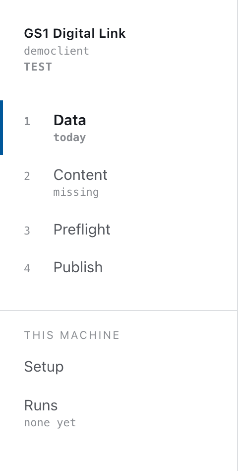

The strip down the left is how you move around. It has two halves, and the difference matters:

- **The numbered four are the batch.** Work down them in order. Under each one the tool shows you
  a small fact about where you stand — how old the spreadsheet is, how many rows are planned. They
  are facts, not ticks: "today" tells you the file is recent, not that it is the right file.
- **Below the line is everything else.** *Setup* is the site settings, set up once and rarely
  touched. *Runs* is the record of what happened. Neither is a step; you go there when you need
  them. (The video mapping used to live here too. It is part of **Data** now, because it decides
  whether a product can be published at all.)

At the top it always says which client you are working on and, underneath, the environment:
**TEST** in grey, or **PRODUCTION** in red. That tag is the single most important thing in the
window — PRODUCTION means the GS1 records this run writes are real and permanent.

If the window is narrow, the strip folds up behind a **☰** button:

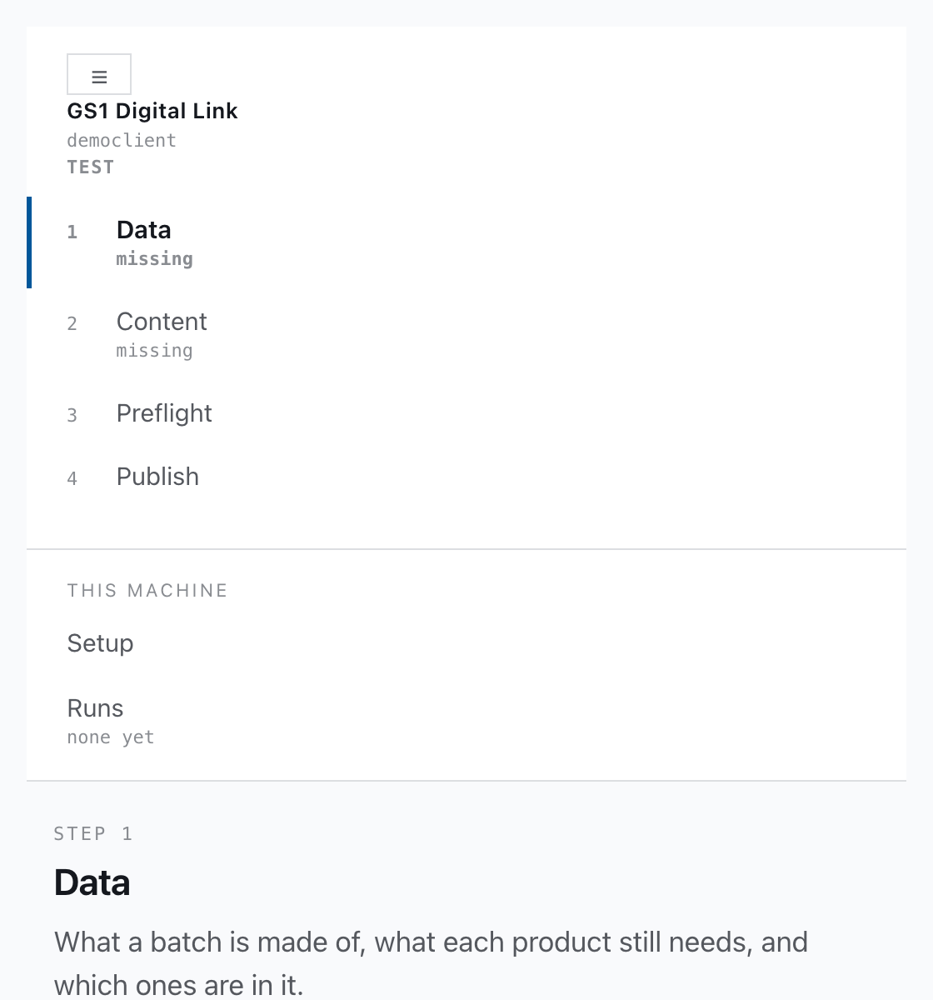

Every screen also prints the exact command it is about to run, in a grey monospaced line. You never
need to type it. It is there so that if something goes wrong, you can copy that line into an email
and whoever helps you knows exactly what happened.

---

## Step 1 — Data

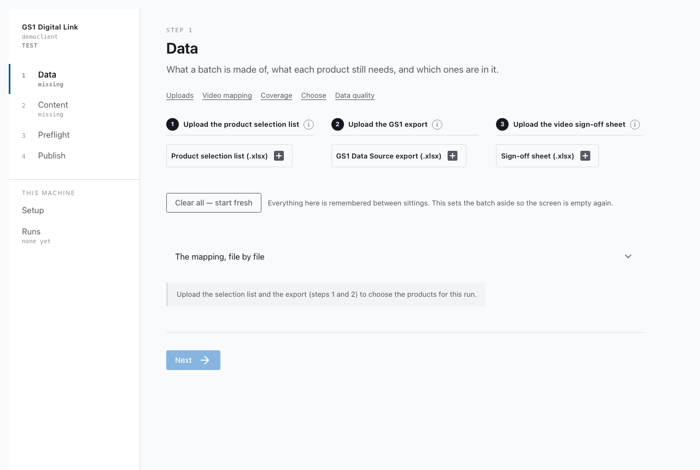

*This is the screen as it opens.* Coverage, the product tables and the quality report appear once
the list and the export are both there — see below.

**What this screen is for:** everything a batch is made of, measured against the one thing you
chose — your list of products. Three files, then **choosing** which products this batch covers. The
links under the title jump to each part.

Every heading has a small **ⓘ** beside it. Press it to read what that file is and where it goes.
Nothing you need to act on is hidden behind one — a warning always sits on the page in a coloured
band.

**Everything is remembered.** Close the app, open it tomorrow, and your files and your saved choice
are still here. To begin a new batch from nothing, press **Clear all — start fresh** under the
uploads. It asks first, then moves the list, your saved choice and the export out of the way —
nothing is deleted, and the client's video sign-offs are not touched.

**What you do:**

1. **Upload the product selection list** — which barcodes this batch may touch. Press the picker
   and choose the spreadsheet. It is read before it replaces anything, so a file that will not open
   is refused and the list you were using stays put.
2. **Upload the GS1 export** — the product *data*. It is read as soon as it arrives: a spinner runs
   while that happens, then a line says how many products it found. **If it is not a GS1 export,
   or something the tool needs is missing, it is put back and nothing changes** — the file you had
   is still there, and the reason appears on screen. Uploading is the check; there is no other
   button.
3. **Upload the video sign-off sheet** — when the client sends it back. See *Videos* below. If
   there is no new sheet, skip this step.

   The three sit side by side because none of them waits on another: bring whichever you have.

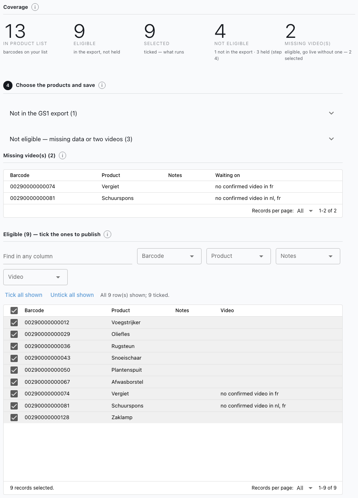

**Coverage** counts your batch, in products, from left to right: how many are **in your product
list**, how many of those are **eligible** (the export has them and nothing stops them being
published), and how many are **selected** (eligible and ticked — what the next run will publish).
The two figures on the right say why the others fell out, and how many eligible products will go
live **without a video**. The figures change as you tick.

4. **Choose the products and save.** Your list, split four ways, in this order:

   - **Not in the GS1 export** — barcodes you asked for that the export has no row for. Nothing
     else in the tool will mention them again. Either the product is missing from the export (fix
     it in MyGS1) or the barcode is wrong.
   - **Not eligible** — the export has them, but a run will not publish them. The **Why** column
     says what is wrong: a mandatory value that is blank (fixed in MyGS1, never here), or two
     videos confirmed for one language (the client has to keep one).
   - **Missing video(s)** — eligible, and they *will* be published, but without a video in the
     language named. Listed so nobody mistakes the live page for finished. When the client confirms
     a video, the next run adds it to the page.
   - **Eligible — tick the ones to publish.** The only table with tick boxes, because it is the
     only one where the choice is yours. Every row arrives ticked; the **Video** column repeats
     which languages a product goes live without a video in.

   The first two tables have no tick boxes on purpose: nothing can publish those products, so there
   is nothing to choose. They stay in your list either way.

   > ⚠️ **A tick means keep.** Untick a product to leave it out. If you used an earlier version of
   > this app, the button under the table said *Remove selected rows* and meant the opposite — it
   > is gone.

   Use the filters to find products; filtering changes only what you can see, never what is
   ticked. Your ticks also survive the client's sign-off sheet being applied — a video arriving can
   move a product into the eligible table without undoing anything you chose.

**Data quality** at the bottom is folded away. It rebuilds every time you open this screen, so
opening the fold always shows a current report — what is missing in the spreadsheet itself, and,
in its first section, which products are waiting on a video and on what. Those values get fixed in
MyGS1 or by the client, not here. The report is written to be forwarded to the client.

When you are done, press **Next** at the foot of the screen. It does two things: it saves your
choice of products, and it takes you on to step 2. There is no separate save button.

**The line above the button says what it will do** — *"Next saves 8 of 9 eligible row(s) — 1
unticked — and goes on to the copy"* — and it updates as you tick. Read that before you press, not
after: it is the one thing that will tell you if you ticked the wrong way round. Pressing then
confirms with **Saved**.

**Done looks like:** both files uploaded without a refusal, nothing unexpected in the first two
tables, and *selected* in Coverage showing exactly the number of products you mean.

**Stop if:** an upload is refused, or a red band says a file cannot be read. Upload it again,
or ask the maintainer for a fresh copy — do not go looking for the file in a folder to replace by
hand.

### Videos — and the sheet the client sends back

A product without a confirmed video in a language is **still published** — just without a video
there. The *Missing video(s)* table and the Video column say which, and after every live run the
tool writes a short data-quality note listing the pages that went live without one. When the client
confirms the video, the next run adds it to the page that is already live.

One case *does* hold a product back: **two videos confirmed for the same language**. The tool will
not pick one for the client, so the product sits in *Not eligible* until one is marked *skip*.

Two kinds of waiting look the same in a count and are different jobs. *needs fr* can mean a French
video exists and nobody has said which product it is — or that no French video has been made yet.
The data-quality report's first section lists both sides, so you and the client can tell them
apart.

**Importing the client's sheet.** You do not have to type barcodes in. When the client sends back
the spreadsheet with the barcodes filled in, upload it in **step 3**.

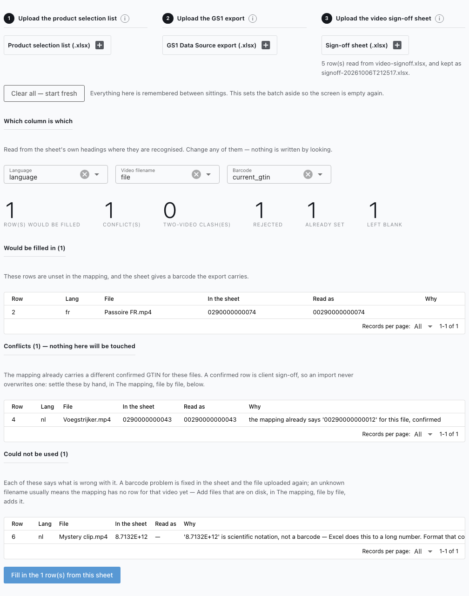

- It needs three columns: the language, the video filename, and the barcode. **You say which is
  which** — the tool reads the sheet's headings, fills the three boxes in with its best guess, and
  you change any it got wrong. So the columns can be called anything at all, and any other columns
  are ignored. The table can sit below a title row, on any sheet of the workbook.
- **Check those three boxes every time, even when they look right.** Reading the wrong column as
  the barcode is the one mistake here that would put the wrong video on a product.
- **Uploading changes nothing in the mapping.** It shows you what the sheet would do, row by row,
  and only then offers a button that does it. The sheet itself is kept, dated, so the data-quality
  report can always say what it still changes.
- **A row the client has already signed off is never overwritten.** If the sheet disagrees with a
  barcode already in the mapping, it is listed as a *conflict* and left exactly as it is. Settle
  those yourself, in *The mapping, file by file*.
- Rows it cannot use say why, and name the row number in the spreadsheet so you can point the
  client at it. The commonest one: a barcode that arrived as **8.7132E+12** because the column was
  formatted as a number. Ask for that column to be set to text and the file sent again — the digits
  are genuinely gone from the file, so there is nothing to recover at this end.
- Dropped a GS1 export in this slot by mistake? It is refused, by name. Nothing is kept.

**The mapping, file by file** is folded under the uploads. Open it to see every video file, per
language, and what it maps to.

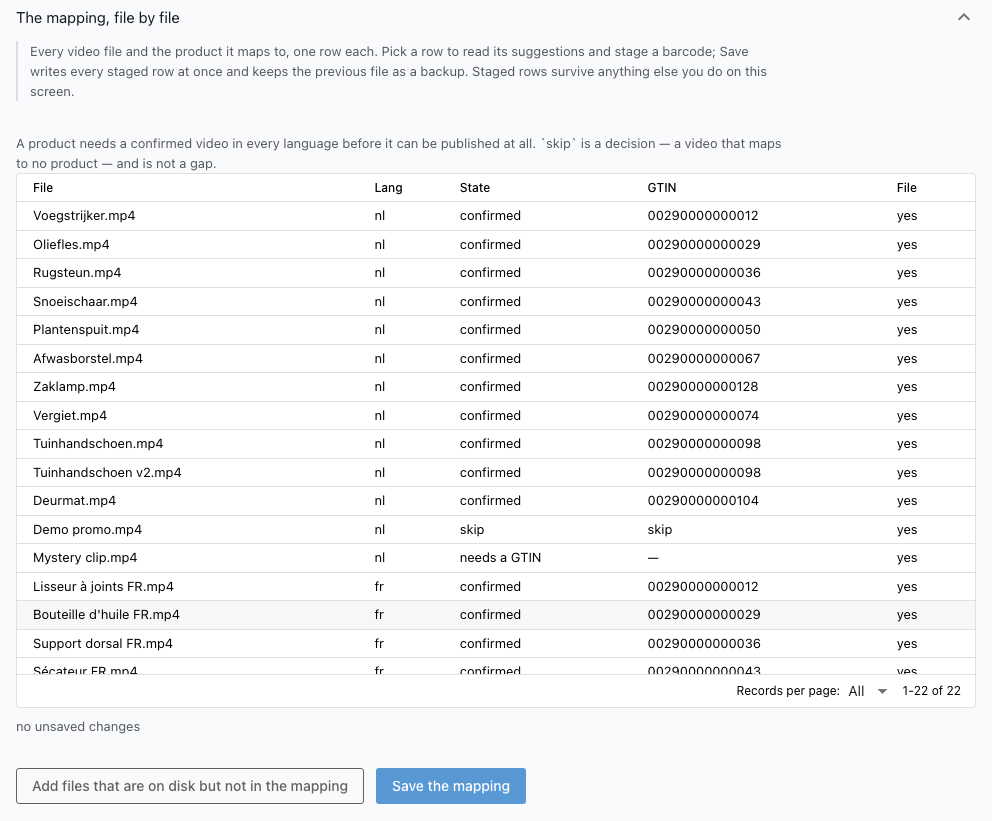

Click a row and you get a box for the barcode, plus a few suggestions — those are a machine guess
at which product the filename means, nothing more. Nothing is written until you press *Save the
mapping*, and the previous version of the file is always kept beside it. Rows you have changed but
not saved stay changed whatever else you do on the screen — but while there are any, a sheet import
refuses to run, because it rewrites the whole file and would otherwise throw your edits away.

After a save or an import, everything on the screen that counts from the mapping updates by itself:
the coverage figures, the Video column, and the report. Your ticks are untouched.

---

## Step 2 — Content

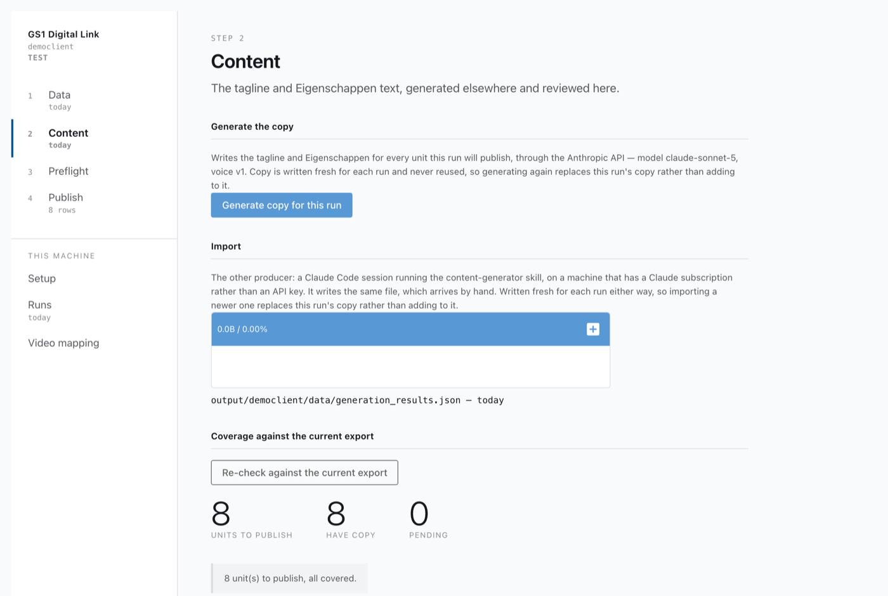

**What this screen is for:** the tagline and the Eigenschappen text that go on each page. They are
written by Claude, not taken from the spreadsheet.

**Where the text comes from — one of two places, depending on how your machine is set up:**

- **Generate the copy** — if this section shows a button, your machine can write the copy itself.
  Press **Generate copy for this run** and wait; the output appears in a black panel as it goes.
- **Import** — otherwise the maintainer writes it and sends you a file called
  `generation_results.json`. Drop it on the upload area here.

Either way the copy is written **fresh for this batch**. Generating or importing again replaces it
rather than adding to it.

**Then read it.** *Coverage against the current export* gives three numbers — how many units this
batch will publish, how many have copy, how many are still pending. You want the middle one to
equal the first and the last to be zero. Below that, *Review the copy* shows the actual text, per
product, per language. **Read it.** This is the last comfortable moment to catch a sentence that is
wrong; after Publish it is on the live site.

**Done looks like:** "N unit(s) to publish, all covered."

**Stop if:** the pending number is not zero. Those products have no text and will be dropped from
the batch silently.

---

## Step 3 — Preflight

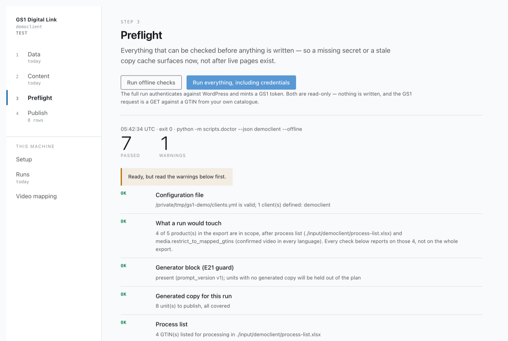

**What this screen is for:** everything that can be checked before anything is written. It runs by
itself when you arrive.

Each line is one check, marked **ok**, **warn** or **FAIL**, with a sentence saying what it found
and — when it failed — what to do about it. The verdict at the top is the one to read first.

- **ok** — nothing to do.
- **warn** — read it. The run can proceed; something is less than ideal.
- **FAIL** — fix it before publishing. The remedy is printed under the check.

Two buttons:

- **Run offline checks** re-runs the cheap half, the one that ran automatically.
- **Run everything, including credentials** also logs in to the website and to GS1. Both are
  read-only — nothing is written. Run this one before a real publish, because a wrong password
  found here costs you nothing, and found at step 4 costs you a half-finished batch.

**Done looks like:** "Ready." — or "Ready, but read the warnings first", once you have read them.

**Stop if:** any check says FAIL.

---

## Step 4 — Publish

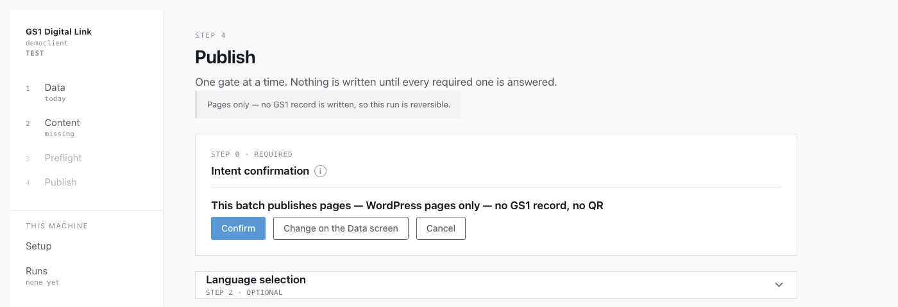

**What this screen is for:** doing it. Nothing is written until you have answered every required
question, and the screen will not let you skip one.

It works as a series of **gates** — one card each, in order, each stating what it is asking and
why. Answer one and the next slides into view. If you are unsure at any gate, **Cancel** is always
there and always safe: it stops the run without having written anything.

**The first gate asks what kind of run this is.** Three choices, and they are not equally
reversible:

| Mode | What it writes | Undoable? |
|---|---|---|
| **pages** | WordPress pages only | Yes — a page can be edited or deleted |
| **links** | GS1 Digital Link records and QR codes, pointing at pages that already exist | **No** |
| **both** | pages first, then the records pointing at them | **The GS1 half: no** |

A band at the top of the screen tells you which of those you are in, all the way through. Grey
means reversible; **red means this run writes permanent records.**

**The gates you will meet, in order:**

1. **Intent confirmation** — the mode, how many products are in scope, and which spreadsheet.
   Check the figures against what you expect. "In scope" is the most this run could touch.
2. **Language selection** — which languages this run covers.
3. **Generated copy review** — confirms you have read the text from step 2.
4. **Plan review** — the tool builds the plan and tells you how many rows it holds and what kind:
   *new* pages, *changed* pages, or unchanged. Choose **All**, **New only**, or **Review changed**
   to walk the changed ones and decide each individually.
5. **Production environment confirmation** — only when the client is on production. You type the
   client id in full into a box before the Confirm button will accept it. Deliberate friction, in
   the one place it is worth it.
6. **Dry run** — runs the whole thing while writing nothing, and shows you the output. **Read it**,
   then Proceed or Cancel.

Then **Write it**, and the run starts. A grey panel fills with the log as it goes, and the button
shows a spinner with the seconds counting up.

**While it is running: do not press anything twice.** The button disables itself, but the rule
underneath is worth knowing — a second run in `links` or `both` mode aims at records that cannot be
deleted.

> **Your answers live on this screen only.** If you navigate to another screen part-way through the
> gates and come back, you start again from the first gate. Nothing is lost except your place, but
> it is worth knowing before you go and check something.

---

## After: Runs

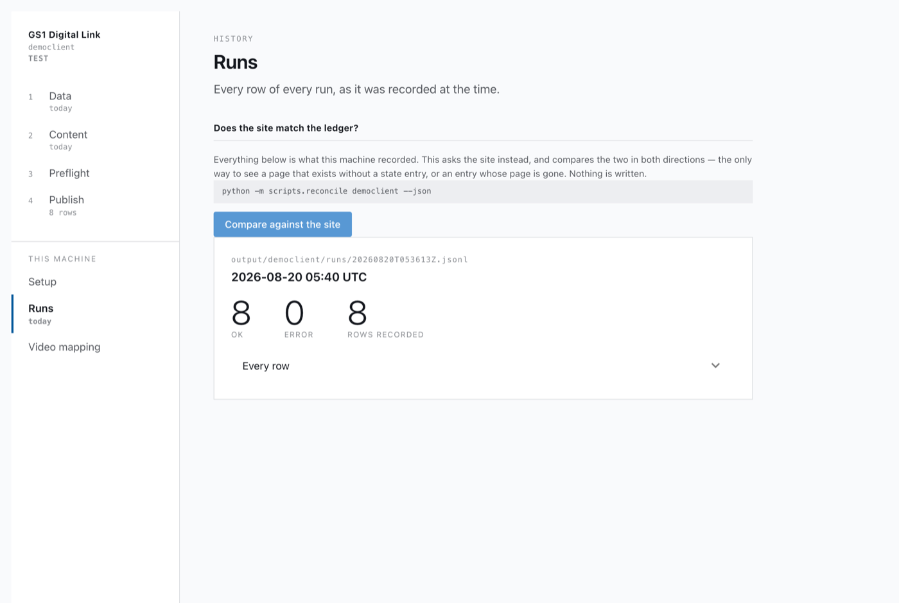

**Runs** is the record of what actually happened — every row of every run, as it was recorded at
the time, newest first. Each card gives you how many rows succeeded, how many failed, and an
expandable list of every one.

A run that stopped half-way shows as a partial run, and says so. That is the case worth looking at:
some pages may be live and some records may already exist for the rows that landed.

**Does the site match the ledger?** at the top asks the website what is actually there and compares
it against this machine's record, in both directions. It only reads; nothing is written. Use it if
you are ever unsure whether a page exists.

**To send the result back to whoever asked for the batch:** press **Build the result sheet** on
the run's card. It writes your scope list again, beside the run log, with what happened to each
row added on the right — one line per product, the page address where there is one, and a plain
reason where there is not. A third tab explains every word in it, so the file can be forwarded on
its own.

Two things it will say that are not failures. **`held`** means the run deliberately left a product
alone — usually no confirmed video, or a mandatory field left blank in MyGS1 — and the reason is in
the row. **`not in export`** means the barcode is on your list and the export has no product for
it. Both are work; neither is something that went wrong during the run.

**One housekeeping job after every batch:** send `output/{client}/state.json` back to the
maintainer. It is the record of everything published, it only exists on the machine that did the
publishing, and two out-of-step copies is how a product gets published twice.

---

## Setup — when you would go there

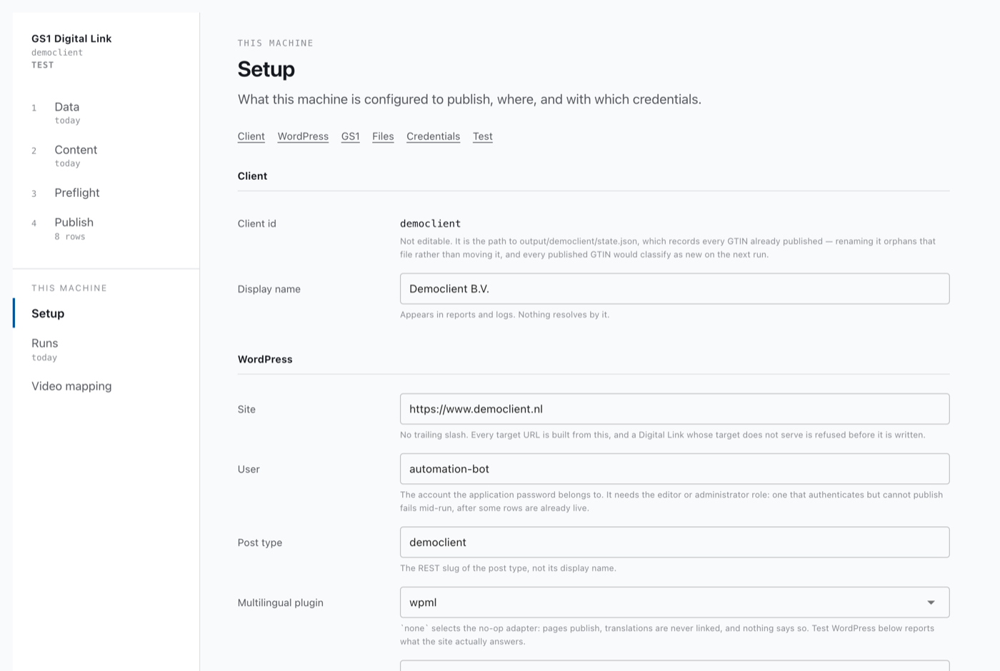

Rarely. **Setup** is the site's settings — the website address, the login, which GS1 environment,
where the files live. It is configured once, by the maintainer.

Two reasons an operator opens it:

- **A password changed.** The *Credentials* section takes the new one. It never shows you an
  existing value, only whether one is set.
- **Something is failing and you want to test one thing.** The *Test* section runs the same checks
  as Preflight, but only the two or three that concern the setting you just changed.

The row of links under the title jumps to a section. The block at the bottom is folded shut because
nothing in it can be edited here — it is there to be read, with the reason beside each item.

**Everything on this screen has a consequence written under it.** Read that line before changing a
field. Switching the GS1 environment to production makes you type the client's name in full first.

---

## When something goes wrong

Work down this list. Anything not on it: take a screenshot, copy the grey command line from the
screen, and send both to the maintainer.

**A red band saying `clients.yml did not load`.**
The settings file is missing or broken. The band has a link to Setup. If Setup also shows red, the
file has not been installed — this is one for the maintainer.

**Preflight says FAIL.**
Read the indented sentence under the check. It is the instruction. Most failures are one of: the
spreadsheet has not been parsed yet (go to Data, press Parse), the copy is missing or stale (go to
Content), or a credential is wrong (Setup → Credentials).

**A check says a file is missing.**
Five files are not in the download and arrive from the maintainer separately. The list is in
[`operator-install.md`](operator-install.md#3-the-five-files-that-are-not-in-the-download). The
important one is `state.json`, the ledger — without it the tool believes nothing has ever been
published.

**The plan has fewer rows than you expected.**
Normal, and usually right. Products are dropped when they are not on the scope list, when they
are already published and unchanged, when they have no confirmed video in every language, or when
mandatory data is missing. The plan gate tells you how many were dropped and why.

**The run finished with errors.**
Go to **Runs**, open the newest run, expand *Every row*. Each failed row carries its own error.
Some rows will have succeeded — those pages are live. Re-running is safe for pages: they are
matched and updated in place, not duplicated.

**You think something was published twice.**
Stop, and do not run again. Use *Does the site match the ledger?* on the Runs screen, and tell the
maintainer what it says.

**It is slow and nothing seems to be happening.**
Look at the button you pressed: if it shows a spinner and a rising number of seconds, it is
working. A twenty-row run is quiet for about ninety seconds by design. Do not press it again.

For anything deeper, [`troubleshooting.md`](troubleshooting.md) has the technical detail — it is
written for a developer, but the error messages in it are the ones you will have seen.

---

## Glossary

Words this tool uses that mean something specific.

| Word | What it means here |
|---|---|
| **GTIN** | The number under a barcode. The tool's identifier for a product — 14 digits. |
| **GS1 Digital Link** | The standard that makes a barcode lead somewhere. A record at GS1 says "this GTIN → this page". |
| **Resolver** | GS1's service that does the leading. Writing to it is what "permanent" refers to. |
| **Batch** (or *wave*) | One pass through Data → Content → Preflight → Publish. |
| **Scope** | Which products a run may touch — after the scope list and the video rule have cut the spreadsheet down. |
| **GS1 Data Source export** | The product spreadsheet from GS1. Data, not scope. Uploaded on Data. |
| **Product scope list** | The separate spreadsheet listing which barcodes this batch covers. Scope, not data. Uploaded on Data, above the tables. Called `selections.xlsx` on disk, under `process/selection/`, and `process_list` in the settings file — same thing. |
| **Result sheet** | Your scope list handed back after a run, with what happened to each row. Built on **Runs**, beside the run it describes. |
| **Plan** | What the run worked out it would do, row by row, before doing any of it. One row per product per language. |
| **Row** | One product in one language. Two languages means two rows for the same product. |
| **New / Changed / Unchanged** | How the plan classifies a row against what is already published. Unchanged rows are not touched. |
| **Held** | A product the plan refuses to publish because something mandatory is missing. It is not an error; it is a decision. |
| **Ledger** (`state.json`) | The record of everything this tool has published. Lives on the machine that did the publishing. |
| **Dry run** | Doing the whole run with the writing switched off, to see what it would do. |
| **Gate** | One question on the Publish screen that must be answered before the run continues. |
| **Preflight** | The list of checks, and the screen that shows them. |
| **ACF / WPML** | WordPress plugins — the one that holds the custom fields, and the one that handles languages. You will only see these named in error messages. |
| **Eigenschappen** | The bulleted feature text on a product page. Dutch for "properties"; it is what the field is called on the site. |

---

*Next: [`operator-install.md`](operator-install.md) for installing and for the files that arrive by
hand · [`troubleshooting.md`](troubleshooting.md) when an error needs chasing down.*
